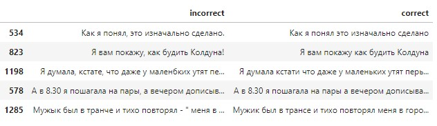
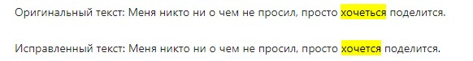
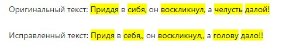
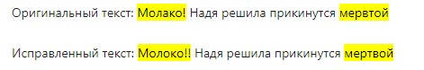

# Модель Исправления Слов на Основе mt5-small

## Обзор
Данная модель предназначена для исправления слов в тексте, используя модель Multilingual T5 от google.

## Исходный датасет

## Процесс Препроцессинга + обучения
Модель разработана в несколько этапов:

1. **Подготовка Данных**
   - объединение данных с двух источников; добавление префикса "Spell correct:"

2. **Создание Dataset, Dataloader**
   - для ускорения обучения данные сначала сортировались по количеству токенов в текстах и затем объединялись в батчи.

3. **Процесс Обучения**
   1. Инициализация модели, оптимизатора, функции потерь
   2. Цикл для обучения 

4. **Инференс Модели**
   1. Восстановление знаков препинания из зиначального текста
   2. Подкрашивание измененных частей текста.

## Примеры работы модели

## Минусы  модели
Модель очень долго обучается (пробовал на боьшем наборе данных); для более менее стабильного качества - много эпох обучения; занимает много памяти.