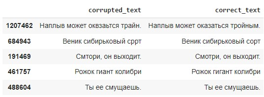
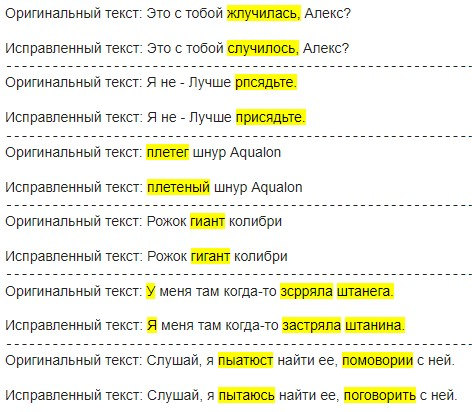

# Модель Исправления Слов на Основе Биграмм и Вероятностного Подхода

## Обзор
Данная модель предназначена для исправления слов в тексте, используя комбинацию биграмм и вероятностного подхода. Модель строится на основе размеченного датасета и способна обрабатывать ошибочные слова, предлагая наиболее подходящие исправления.

## Исходный датасет

## Процесс Создания
Модель разработана в несколько этапов:

1. **Подготовка Данных**
   - Создание словарей для биграмм, ошибочных и правильных слов из размеченного датасета.

2. **Оценка Вероятности**
   - Оценка вероятности последовательности слов с использованием биграмм.

3. **Процесс Исправления**
   1. Прямой проход исправления: поиск в словаре ошибочных слов для нахождения замен.
   2. Выбор наиболее подходящего варианта исправления на основе биграмм и вероятности появления слова в случае наличия нескольких вариантов.
   3. Изменение правильного слова на 1 или 2 буквы и повторение оценки вероятности.
   4. Восстановление пунктуации и подкрашивание слов, которые были изменены, а также слов, на которые они были заменены.

## Примеры работы модели

## Минусы  модели
Данный вероятностный подход не применим к сложным задачам и заточен под выборку, на которой создаются словари для поиска. Подойдет для локального пользования и если возможный набор слов ограничен.